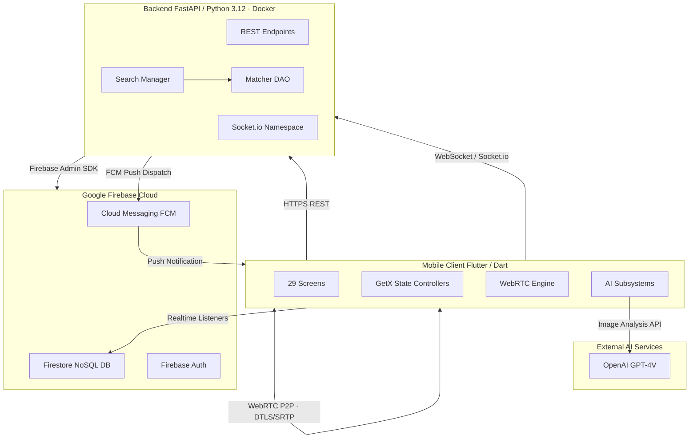
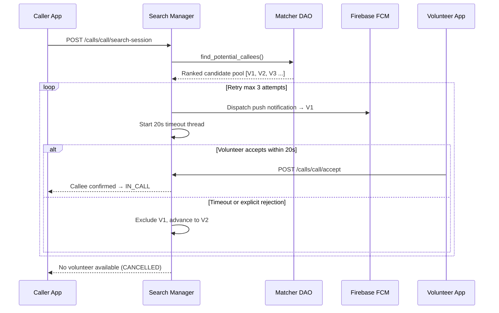
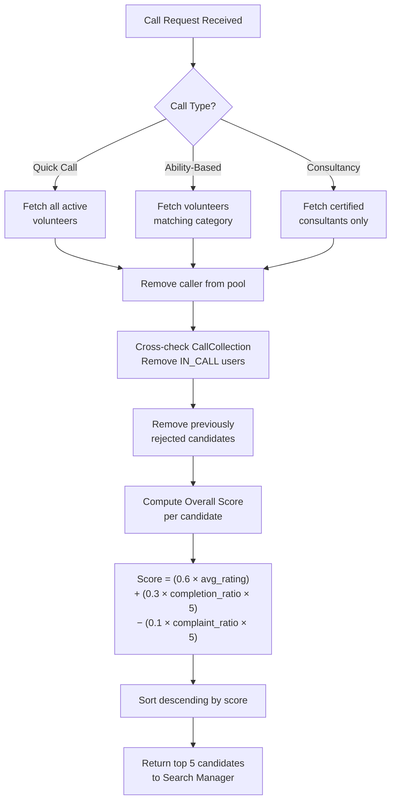
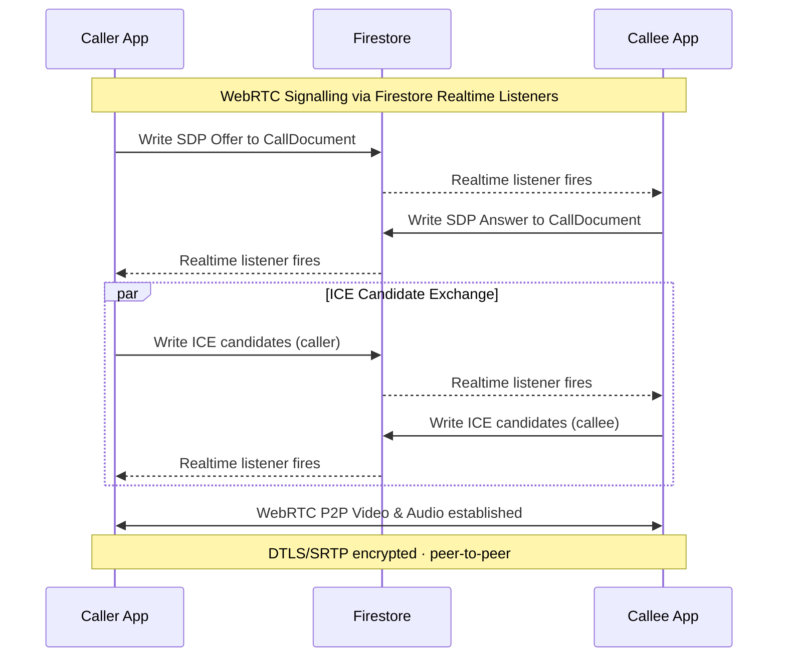
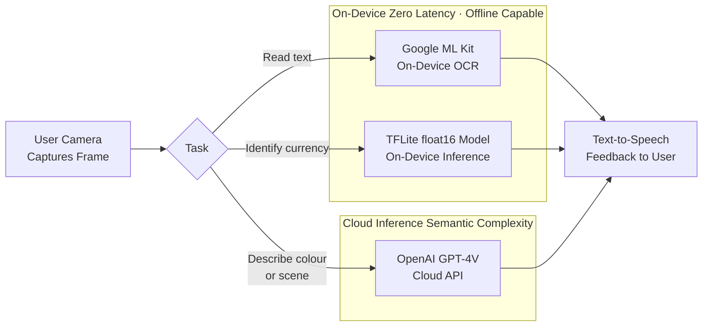
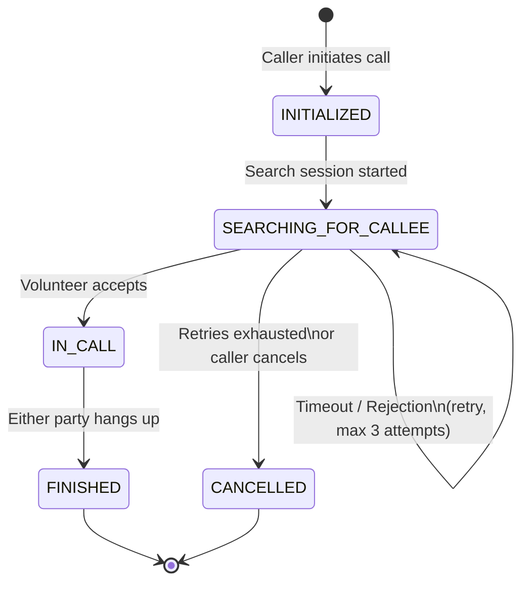

# Project Portfolio Document

## Yoldas (Companion)  Assistive Technology Platform for the Visually Impaired

**Applicant:** Furkan Çalık
**Project Type:** Senior Capstone  Full-Stack Assistive Technology Product
**Repository:** github.com/furkanCalik7/Yoldas
**Team Size:** 5 Engineers
**Platform:** Cross-platform Mobile Application (iOS & Android)


## 1. Executive Summary

Yoldas  meaning *Companion* in Turkish is a production-grade, cross-platform mobile platform engineered to restore independence for visually impaired individuals through on-demand human connection and AI-powered environmental interpretation. The project identifies and directly addresses a systemic gap in assistive technology: existing solutions are either prohibitively expensive, hardware-dependent, or passive  they describe the world without connecting the user to another human being in real time.

The core hypothesis is that technology's highest contribution to accessibility is not to replace human empathy but to eliminate the *logistical barrier* between a blind person who needs help and a qualified, willing volunteer. Yoldas operationalises this hypothesis through a live video call platform that intelligently matches visually impaired users to volunteers based on expertise, availability, historical reliability, and complaint history  all mediated by a custom-built, multi-factor scoring algorithm.

Beyond human-assisted calls, the application embeds three distinct AI subsystems: an on-device currency recognition engine powered by a quantised TensorFlow Lite model; an OCR pipeline using Google ML Kit for real-time text extraction; and a multimodal image analysis layer leveraging OpenAI's GPT-4V API for colour identification and scene description. These capabilities are surfaced through a camera interface designed from first principles for accessibility  with Text-to-Speech feedback, semantic widget labelling, and an audio-guided user manual.

The engineering infrastructure reflects industry standards: a Python FastAPI backend containerised in Docker and deployed via a GitHub Actions CI/CD pipeline, a Firebase-backed real-time database and authentication layer, WebRTC for peer-to-peer video transmission, and Socket.io for low-latency call signalling. The project accumulated 358 commits and 122+ merged pull requests over its development lifecycle, indicating sustained, methodical engineering discipline rather than a speculative prototype.

Yoldas is not a student exercise. It is a functioning product, deployed to a live server, built in collaboration with associations for the visually impaired, and architected to scale.


## 2. Innovation & Originality

### 2.1 The Whitespace in Assistive Technology

The global assistive technology market  valued at approximately $26 billion is dominated by hardware peripherals (refreshable Braille displays, screen readers) and isolated software tools (JAWS, TalkBack, VoiceOver). What is conspicuously absent is a platform that combines **real-time human assistance** with **on-device AI augmentation** in a single, accessible, open-access application. Commercial analogues such as Microsoft's *Seeing AI* and the *Be My Eyes* application address portions of this problem, but neither offers the combination of intelligent volunteer matching, multi-modal AI tooling, and a structured consultancy tier within a single product.

Yoldas differentiates on three axes:

**1. Intelligent Volunteer Routing vs. Random Queueing**
Where *Be My Eyes* dispatches calls to whichever volunteer picks up first, Yoldas applies a deterministic, weighted scoring model to select the optimal available volunteer before any notification is sent. This is not a cosmetic difference  it has direct implications for call completion rates, user satisfaction, and repeat engagement. The scoring function weights average rating at 60%, call completion ratio at 30%, and penalises volunteers with proportionally high complaint-to-call ratios at 10%, normalised across total calls. This reflects a nuanced understanding of reliability under varying workloads, not merely popularity.

**2. Three Differentiated Service Tiers**
The application implements three architecturally distinct call flows: a *Quick Call* mode that prioritises availability, an *Ability-Based Call* that filters volunteers by declared domain expertise (e.g., medical guidance, legal support, navigation assistance), and a *Consultancy Call* that routes exclusively to credentialed consultants. This tier model mirrors the triage logic found in professional service platforms and healthcare routing systems.

**3. Hybrid On-Device and Cloud AI**
Rather than relying solely on cloud APIs  which introduce latency and cost at scale  Yoldas employs a hybrid inference strategy. Currency recognition runs entirely on-device via a quantised `float16` TFLite model, ensuring zero-latency, offline-capable operation for a task where response speed is critical. OCR is handled by Google ML Kit's on-device engine. Cloud inference via GPT-4V is reserved for semantically complex tasks (colour interpretation, scene description) where a large multimodal model's capabilities are genuinely necessary. This architectural decision demonstrates engineering maturity: the right tool for the right task, not indiscriminate cloud dependency.


## 3. Technical Architecture

### 3.1 System Overview

Yoldas is structured as a distributed three-tier system: a cross-platform mobile client (Flutter/Dart), a stateless RESTful and WebSocket backend (Python/FastAPI), and a managed cloud data and auth layer (Google Firebase). These tiers communicate via HTTPS for transactional operations, Socket.io for call signalling events, WebRTC for peer-to-peer media, and Firebase Firestore real-time listeners for call state synchronisation.



### 3.2 Frontend  Flutter (Dart)

The client application is built on Flutter, providing a single compiled binary targeting both iOS and Android from a shared codebase. State management uses the GetX reactive framework, which provides declarative binding between UI components and controller state without the boilerplate overhead of BLoC or Provider. The application comprises 29 screens and manages complex asynchronous flows  including call lifecycle transitions, AI camera pipelines, and real-time socket events  through a layered controller architecture that cleanly separates business logic from presentation.

Key client-side engineering challenges solved:

- **WebRTC peer connection management**: Establishing, maintaining, and tearing down peer connections with appropriate ICE candidate negotiation using public STUN servers. Signal exchange was migrated mid-development from Socket.io to Firebase Firestore listeners to improve reliability under network variance.
- **SMS OTP auto-fill**: Automated interception of incoming SMS verification codes via platform channel integration, reducing onboarding friction for a user group that may find manual input challenging.
- **Audio device switching**: Dynamic routing between earpiece and loudspeaker during live calls, essential for hands-free operation.
- **Accessibility-first UI**: All interactive elements carry semantic labels for screen reader compatibility. TTS feedback is injected at critical navigation nodes. The application ships with an embedded audio-guided user manual specifically authored for visually impaired users.

### 3.3 Backend  FastAPI (Python 3.12)

The backend is a Python 3.12 FastAPI application exposing 16 REST endpoints and a Socket.io namespace. It is structured into four layers: routers (HTTP/WebSocket handlers), services (orchestration logic), DAOs (Firestore data access), and models (Pydantic schemas for request/response validation and serialisation).

The most architecturally significant component is the **Search Manager**, which orchestrates the asynchronous volunteer-search lifecycle. When a call is initiated, the Search Manager:

1. Invokes the Matcher DAO to compute and rank a candidate pool of up to 5 volunteers using the weighted scoring algorithm.
2. Dispatches an FCM push notification to the highest-ranked available candidate.
3. Starts a threaded timeout session (20 seconds) awaiting acceptance.
4. On timeout or rejection, excludes the candidate from the pool and retries, up to a maximum of 3 sequential attempts.
5. On exhaustion, returns a no-volunteer-found signal to the caller.

This retry-with-exclusion pattern mirrors production-grade job dispatch systems and required careful handling of thread safety around in-memory search session state.



**Volunteer Scoring Formula:**

```
Overall Score = (0.6 × avg_rating)
              + (0.3 × (calls_completed / calls_received) × 5)
              − (0.1 × (complaint_count × 5 / calls_completed))
```

Edge cases (zero calls received, zero calls completed) are explicitly handled by substituting the user's average rating, preventing division by zero and ensuring fair treatment of new volunteers.



### 3.4 Real-Time Communication Stack

The application employs three concurrent real-time channels, each selected for its appropriate use case:

| Channel | Protocol | Purpose |
|---|---|---|
| Call signalling | Socket.io (WebSocket) | Call request, accept, reject, hangup events |
| Media transmission | WebRTC (DTLS/SRTP) | Encrypted peer-to-peer audio/video |
| State synchronisation | Firestore Realtime | ICE candidates, call status, SDP offer/answer |



### 3.5 AI Subsystems

| Feature | Model / API | Inference Location |
|---|---|---|
| Currency recognition | Custom TFLite `float16` model | On-device |
| Text extraction (OCR) | Google ML Kit | On-device |
| Colour & scene analysis | OpenAI GPT-4V | Cloud |



### 3.6 Infrastructure & DevOps

The backend is containerised via Docker with a `docker-compose.yml` configuration for single-command deployment. A GitHub Actions workflow automates the full deployment pipeline: on every push to `master`, the workflow SSHes into the production server, pulls the latest commit, and executes the container rebuild script. This eliminates manual deployment steps and enforces a consistent release process across all contributors.

**Security implementation** includes JWT-based authentication (HS256, 30-minute expiry), bcrypt password hashing, OAuth2 password bearer token scheme, and encrypted client-side token storage via Flutter Secure Storage.

```mermaid
flowchart LR
    Dev[Developer\ngit push to master] --> GHA[GitHub Actions\nWorkflow Trigger]
    GHA --> SSH[SSH into\nProduction Server]
    SSH --> Pull[git pull\nlatest commit]
    Pull --> Down[docker-compose down\nStop running container]
    Down --> Build[docker-compose build\nRebuild image]
    Build --> Up[docker-compose up -d\nStart container]
    Up --> Live["FastAPI Live\n:8000"]

    style Dev fill:#24292e,color:#fff
    style Live fill:#2ea44f,color:#fff
    style GHA fill:#0366d6,color:#fff
```



Also illustrating the call lifecycle as a formal state machine:




## 4. Impact & Scalability

### 4.1 Addressable Problem at Scale

According to the World Health Organisation, approximately 2.2 billion people globally have a near or distance vision impairment, of whom at least 1 billion have a condition that could have been prevented or has yet to be addressed. In the UK alone, approximately 2 million people live with sight loss, with this figure projected to double by 2050 (RNIB, 2023). The demand for personalised, on-demand assistance for this population is structurally unmet by public services and prohibitively expensive when met privately.

Yoldas targets this gap with a volunteer-mediated model that is cost-effective at scale precisely because the marginal cost of adding a volunteer is near-zero, and the matching algorithm ensures volunteer time is allocated efficiently  maximising call completion rates rather than wasting high-quality volunteer availability on cold-start matching.

### 4.2 Commercialisation Pathways

The architecture is designed to support multiple monetisation and partnership models without structural redesign:

- **SaaS licensing to disability charities and NHS trusts**: The backend can be white-labelled and deployed per-organisation, with custom volunteer pools and category taxonomies. The existing consultancy tier maps naturally onto NHS patient triage and social care referral workflows.
- **B2B integration API**: The volunteer matching and real-time call infrastructure can be exposed as an API layer for third-party assistive apps, telecommunications providers, or smart device manufacturers seeking to embed human-assistance features.
- **Premium AI tier**: The GPT-4V integration provides a foundation for a premium subscription offering advanced scene interpretation, document summarisation, and contextual navigation assistance  features with demonstrated willingness-to-pay among visually impaired users.
- **Data-informed volunteer quality improvement**: The complaint and rating system generates longitudinal behavioural data that can train recommendation improvements and inform volunteer development programmes  a feedback loop that improves service quality without additional operational cost.

### 4.3 Alignment with UK/Australia Tech Ecosystem Priorities

The project sits at the intersection of three priority areas for both the UK's National Disability Strategy and Australia's Technology Innovation Hub agenda: digital accessibility, AI-augmented social care, and scalable telehealth infrastructure. The on-device inference approach specifically addresses data sovereignty and latency concerns raised by both the ICO (UK) and the OAIC (Australia) in their AI governance frameworks  demonstrating that the project was designed with regulatory awareness, not retrofitted compliance.


## 5. Leadership & Recognition

### 5.1 Role and Contribution

Yoldas was developed by a five-person team of final-year Computer Engineering students at Bilkent University. As the **repository owner and primary technical lead**, Furkan Çalık held end-to-end responsibility for the system's most complex components, contributing to all three tiers of the stack.

Documented contributions include:

**Core Infrastructure & Backend**
- Designed and implemented the **Search Manager**  the central orchestration engine managing asynchronous volunteer search sessions, threading-based timeouts, retry logic, and FCM dispatch sequencing.
- Authored the backend **user and call endpoints** (16 REST + WebSocket handlers), Pydantic model schemas, and DAO layer.
- Implemented the **complaint endpoint** and the structured complaint-to-score deduction pipeline.
- Deployed and maintained the live production server, including Docker configuration and GitHub Actions CI/CD pipeline.

**Real-Time Communication**
- Led the full **WebRTC peer connection implementation**: ICE negotiation, SDP offer/answer exchange, connection teardown, and the architectural decision to migrate signal exchange from Socket.io to Firebase Firestore streams for improved reliability.
- Implemented the **hangup** and **call incoming** features, completing the full call lifecycle on both caller and callee sides.
- Developed **audio device switching** (earpiece/speaker toggle) during live calls.

**Frontend & Accessibility**
- Built the **call type selection**, **volunteer search**, and **already-answered** screens.
- Implemented **SMS OTP auto-fill** for accessible onboarding.
- Authored the **audio-guided user manual** for visually impaired users.
- Led two rounds of platform-wide **accessibility improvements** covering semantic widget labelling, TTS integration, and UI corrections.

**Project Integrity**
- Resolved critical production bugs including the multiple-call notification race condition, feedback submission failure, and call count discrepancy.
- Managed 122+ pull requests across the team's branches, maintaining code quality and integration consistency over the full development lifecycle.

### 5.2 Evidence of Engineering Maturity

The 358-commit, 122-PR history is a quantifiable record of sustained, structured engineering practice: feature branches, code review, issue-tracked development (Jira ticket references visible in commit messages), and iterative bug resolution. This is the output of a team operating at a professional software development cadence, not an academic sprint.

The project was developed in active collaboration with associations for the visually impaired, ensuring that design decisions were validated against real user needs  a standard of applied research rigour that goes beyond coursework requirements.